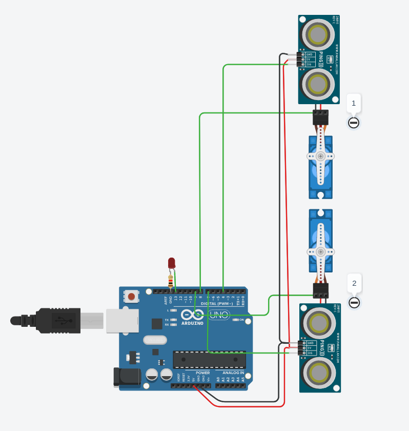

# Sprawozdanie nr 6 {.center}
### Arduino – przejazd kolejowy {.center}
### Bartłomiej Mumot 141287 {.center}

[Tinkercad](https://www.tinkercad.com/things/2lSSJsvYxbR)

### schemat




### kod
```c
#include <Servo.h>

Servo servo_1;
Servo servo_2;

int inches = 0;

int cm1= 0;
int cm2= 0;

 volatile bool led_on = true;

 volatile int counter = 0;

int state = 0;
void setup()
{
  Serial.begin(9600);
  servo_1.attach(8);
  servo_2.attach(9);
  pinMode(13, OUTPUT);
  digitalWrite(13, 1); 

  setTimerInterrupt(1000000); // int @1ms (1000 us)
  open();
}

void loop()
{
  cm1 = readUltrasonicDistance(4,4);
  cm2 = readUltrasonicDistance(7,7);
  
  if(cm2 < 19000){
    if(!state || state == -1){
      	close();
   		state = 2;
    }else if( state == 1 ){
      open();
      state = -2;
    }
  }else{
  if(state == -2)
    state = 0;
  }
  
  if(cm1 < 19000){
    if(!state || state == -2){
      	close();
   		state = 1;
    }else if( state == 2 ){
    	open();
      state = -1;
    }
  }else{
  if(state == -1)
    state = 0;
  }
  
  Serial.print(cm1);
  Serial.print(" ");
  Serial.print(cm2);
  Serial.print(" ");
  Serial.println(state);
}

ISR(TIMER2_COMPA_vect) {
  counter++;
  if(!(counter % 50)){
	if(led_on)
        digitalWrite(13, !digitalRead(13)); 
    else
      digitalWrite(13, 0); 
  }
}

long readUltrasonicDistance(int triggerPin, int echoPin)
{
  pinMode(triggerPin, OUTPUT);  // Clear the trigger
  digitalWrite(triggerPin, LOW);
  delayMicroseconds(2);
  // Sets the trigger pin to HIGH state for 10 microseconds
  digitalWrite(triggerPin, HIGH);
  delayMicroseconds(10);
  digitalWrite(triggerPin, LOW);
  pinMode(echoPin, INPUT);
  // Reads the echo pin, and returns the sound wave travel time in microseconds
  return pulseIn(echoPin, HIGH);
}


void setTimerInterrupt(long uSecs) {
  noInterrupts();           // disable all interrupts           
  OCR2A = 0x3E; //250ms

  TCCR2A |= (1 << WGM21); //Wlaczenie trybu CTC (Clear on compare match)
  TIMSK2 |= (1 << OCIE2A); //Wystapienie przerwania gdy zliczy do podanej wartosci
  TCCR2B |= (1 << CS21); //U// enable timer compare interrupt

  interrupts();             // enable all interrupts
}

void close () {
	led_on = true;
  	delay(3000);
  	servo_2.write(0);
  	servo_1.write(0);	
}

void open () {
  	servo_2.write(90);
  	servo_1.write(90);	
	led_on = false;
  	
}
```